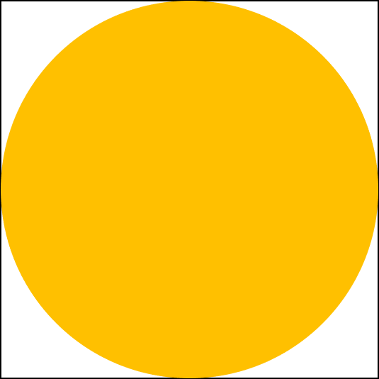

# MonteCarloPI
  
Get π with Monte Carlo Simulation
  
## Requirements
* Python 3.7.x

## Theory
Consider a square with a length of 2 and a circle with a radius of one. Area of square is 4 and Area of circle is π.  
  

π/4 is correspond to (Area of circle) / (Area of square). And we can get ratio by counting the number of randomly scattered points in the circle. If there are enough points to cover the plane, we can get more accurate value of π.

## Contact
You can contact me via e-mail (jyp10987 at gmail.com) or github issue.
